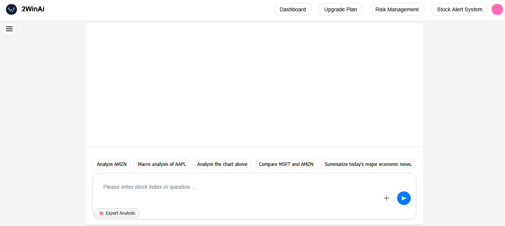
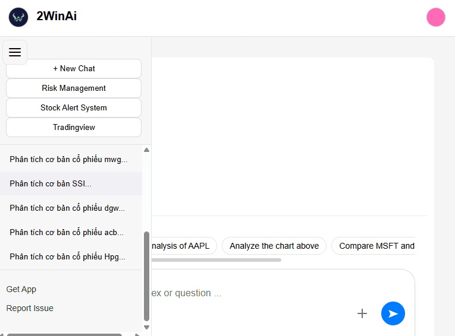
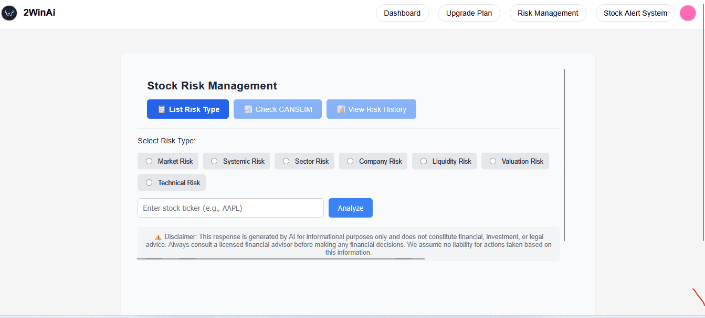
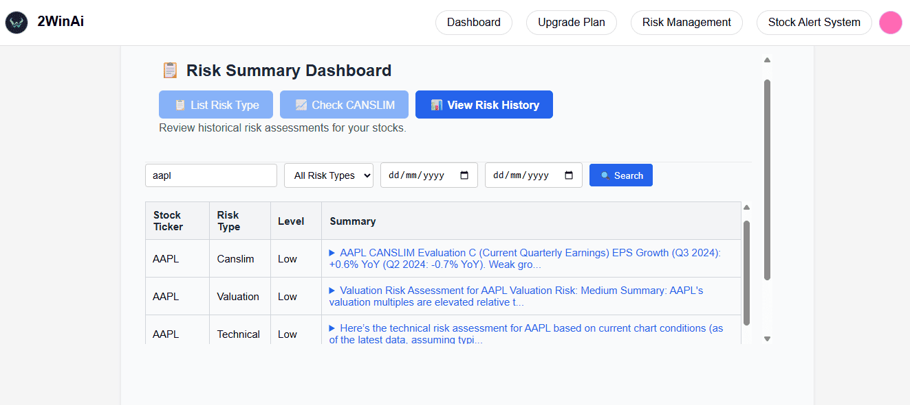
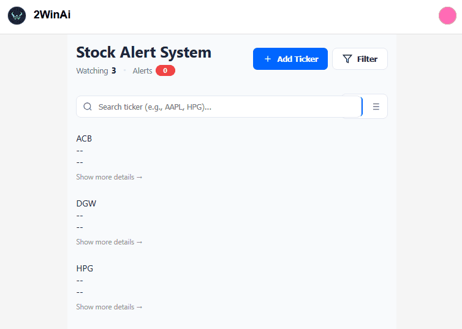
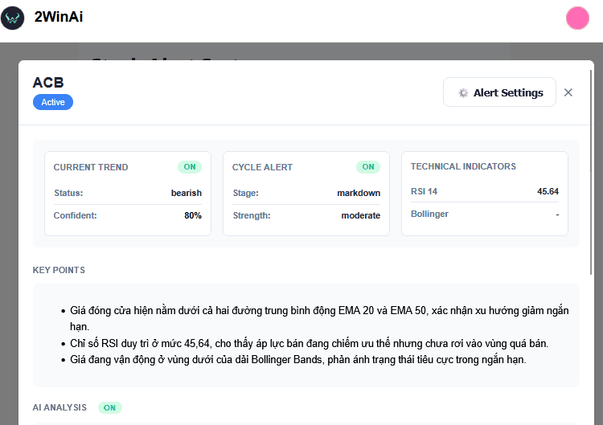
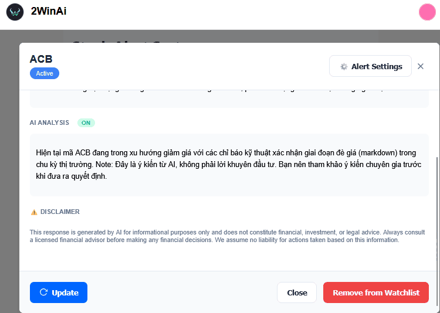
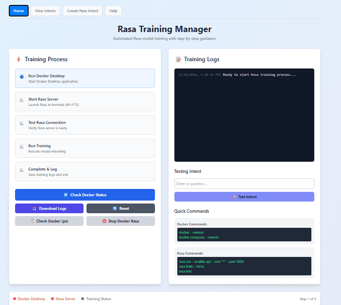
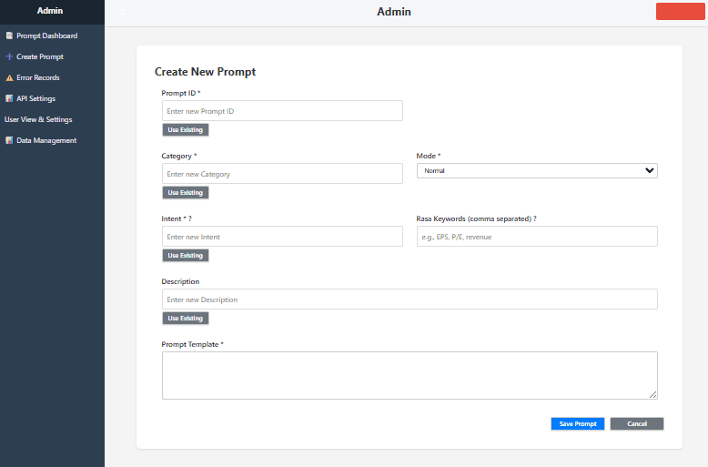
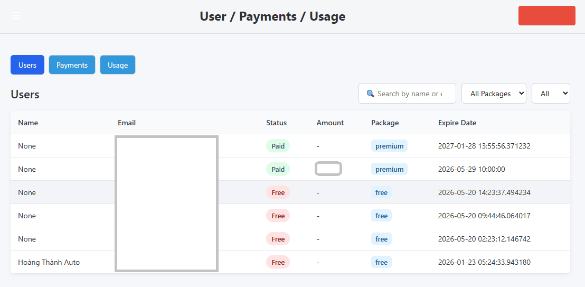

# Tran Hoang (Tommy) Soft

**Senior Full-Stack Engineer | AI-Powered Financial Systems**

Building production-grade intelligent platforms that combine real-time AI, financial data pipelines, and scalable cloud architecture.

---

### 🚀 Featured Project: **2winai**

> AI Stock Risk & Watchlist Platform — Full-stack, production-deployed, built and maintained by a single senior engineer.

Full-stack AI platform for financial market analysis, intelligent conversation, and automated risk & alert management.  
Supports **Web (Flask)** and **Mobile (React Native)** with a unified backend deployed on **Google Cloud Run**.

2winai is composed of **5 independent, self-contained systems** — each operates autonomously with no dependency on the others:

---

#### 🤖 System 1 — AI Chatbot Engine

<p align="center">
  
</p>
<p align="center">
  
</p>

A conversational AI interface for market queries and in-depth financial analysis.

- Natural language understanding with **custom-trained Rasa NLU** (intent classification + entity extraction)
- **Two independent modes**, each with its own dedicated system prompt:
  - **Normal Chat** — General financial Q&A
  - **Expert Analysis** — Deep-dive queries with enriched live market context
- Security validation applied on all user inputs before processing
- Multi-LLM backend with primary/fallback strategy *(see LLM Strategy below)*

---

#### ⚠️ System 2 — Risk Analysis Engine

<p align="center">
  
</p>
<p align="center">
  
</p>

Automated, multi-dimensional risk assessment — runs independently, triggered on demand or via scheduled jobs.

- Analyzes multiple risk dimensions using LLM inference (API-based only — **no model training**)
- Background processing with real-time UI progress: each dimension result appears incrementally as it completes
- Designed to be modular; dimensions can be extended or reconfigured without affecting other systems

---

#### 🔔 System 3 — Alert & Watchlist Agent

<p align="center">
  
</p>
<p align="center">
  
</p>
<p align="center">
  
</p>

Autonomous background agent for continuous market monitoring — fully decoupled from Systems 1 and 2.

- Monitors user watchlists on a scheduled basis
- Detects significant trend changes and signal anomalies using LLM inference (API-based only — **no model training**)
- Delivers timely notifications via **email** and **in-app alerts**
- Operates entirely in the background with no user interaction required

---

#### 🛠️ System 4 — Rasa Training Manager

<p align="center">
  
</p>

An internal desktop/web tool for managing the full lifecycle of the custom Rasa NLU model — built, tested, and operated entirely in-house.

- **Step-by-step guided training pipeline:**
  1. Run Docker Desktop
  2. Start Rasa Server
  3. Test Rasa Connection
  4. Run Training (force retrain)
  5. Complete & Log
- **Real-time Training Logs** panel — live output streamed directly from the Rasa process
- **Intent Testing** — enter any question and instantly verify the classified intent against the live model
- **Quick Commands** reference panel — Docker and Rasa CLI commands always visible
- **Status indicators** — Docker Desktop / Rasa Server / Training Status tracked in real time
- **Actions**: Check Docker Status · Download Logs · Reset · Check Docker (ps) · Stop Docker Rasa

> This system ensures the Rasa model can be reliably rebuilt, validated, and deployed by any team member — no CLI expertise required.

---

#### 🔧 System 5 — Admin Prompt & Data Management

<p align="center">
  
</p>
<p align="center">
  
</p>

A full-featured internal admin panel for managing AI prompts, user settings, and operational data — the control center of the 2winai intelligence layer.

**Modules:**

| Module | Description |
|---|---|
| 📊 **Prompt Dashboard** | View and manage all prompt templates in use across the platform |
| ➕ **Create Prompt** | Create new prompts with: Prompt ID · Category · Mode · Intent · Rasa Keywords · Description · Prompt Template |
| ⚠️ **Error Records** | All reported issues and system errors are **automatically saved to the database** for tracking, audit, and resolution |
| ⚙️ **API Settings** | Configure LLM API keys, model selection, fallback priority, and endpoint settings |
| 👤 **User View & Settings** | Manage user accounts, quota limits, subscription tiers, and access permissions |
| 🗄️ **Data Management** | Manage financial data sources, cache, and pipeline configurations |

**Prompt Creation Fields:**
- `Prompt ID` — Unique identifier for each prompt template
- `Category` — Logical grouping (e.g., risk, chat, alert)
- `Mode` — Normal / Expert / Custom
- `Intent` — Mapped Rasa intent that triggers this prompt
- `Rasa Keywords` — Comma-separated keywords used in Rasa training data (e.g., EPS, P/E, revenue)
- `Description` — Human-readable explanation of what this prompt does
- `Prompt Template` — The actual LLM system prompt body

> The tight integration of Rasa intents and prompt templates in this admin panel is what enables precise, **intent-driven LLM responses** — a core architectural differentiator of 2winai.

---

#### 🐛 Issue Reporting → Database

All user-reported issues and system error events are captured, structured, and **persisted to PostgreSQL (Cloud SQL)**:

- Users can report issues directly from the UI
- Each report is timestamped, categorized, and linked to user session context
- Errors from background agents (Risk Engine, Alert Agent) are also auto-logged
- The **Error Records** module in the Admin Panel provides full visibility and audit trail
- Enables proactive monitoring, triage, and product improvement — no issues get lost

---

### 🧠 Multi-LLM Strategy

| Role | Models |
|---|---|
| **Primary** | One of: **Grok**, **Gemini**, or **ChatGPT** — selected based on reliability and performance |
| **Fallback** | The remaining models activate automatically when the primary is unavailable, slow, or degraded |
| **Extended** | **OpenRouter** used occasionally for additional model access |

- The caller (chat, risk, alert) always knows which model is active — fallback is explicit and logged, not hidden
- All LLMs are consumed via **API inference only — no fine-tuning, no training, no custom model development**

---

### 🏗️ Architecture Overview

```
┌────────────────────────────────────────────────────────────────────────┐
│                          2winai Platform                               │
│              (Google Cloud Run + Docker + GitHub Actions CI/CD)        │
├──────────────┬──────────────┬──────────────┬──────────────┬────────────┤
│  System 1    │  System 2    │  System 3    │  System 4    │  System 5  │
│  AI Chatbot  │  Risk        │  Alert &     │  Rasa        │  Admin     │
│  Engine      │  Analysis    │  Watchlist   │  Training    │  Prompt &  │
│              │  Engine      │  Agent       │  Manager     │  Data Mgmt │
│              │              │              │              │            │
│ • Rasa NLU   │ • Multi-dim  │ • Scheduled  │ • Build &    │ • Prompt   │
│ • Normal /   │   Risk Score │   Agent      │   Retrain    │   CRUD     │
│   Expert     │ • Real-time  │ • Trend Det. │ • Live Logs  │ • Intent   │
│   mode       │   Progress   │ • Email +    │ • Intent     │   Mapping  │
│ • Prompts    │ • Background │   In-app     │   Testing    │ • Error DB │
│ • Security   │   Threading  │   Notify     │ • Docker Mgmt│ • User Mgmt│
└──────────────┴──────────────┴──────────────┴──────────────┴────────────┘
                        │            │             │
                        └────────────┴─────────────┘
                              (each system independent)
                                       │
                       ┌───────────────▼───────────────┐
                       │        Multi-LLM Layer         │
                       │  Primary: Grok / Gemini /      │
                       │  ChatGPT  +  Fallback chain    │
                       └───────────────┬───────────────┘
                                       │
                       ┌───────────────▼───────────────┐
                       │    Financial Data APIs         │
                       │    PostgreSQL (Cloud SQL)      │
                       │    Issue & Error DB (Cloud SQL)│
                       └───────────────────────────────┘
```

---

### 💼 Technical Expertise

- **Backend & Architecture**: Python, Flask, PostgreSQL, Background threading, Real-time streaming progress, Modular independent service design
- **AI Layer**: Rasa NLU (custom build, train, test pipeline), Multi-LLM orchestration, Prompt engineering, Intent-driven prompt routing, Input security validation
- **Data & Integration**: Multiple financial market APIs, Real-time data enrichment pipelines, Issue & error tracking persistence
- **Cloud & DevOps**: Google Cloud Run, GitHub Actions CI/CD, Docker, Cloud SQL
- **Admin & Tooling**: Internal admin panel (prompt CRUD, user management, error records, API config), Rasa Training Manager desktop tool
- **Security & Scalability**: Google OAuth, JWT, Rate limiting, Secure input pipeline, Usage quota enforcement
- **Payment Integration**: **PayPal** (global subscriptions & payments), **Google Pay** (Google-ecosystem billing), **VNPay** (Vietnam domestic payment gateway) — full payment lifecycle: checkout, webhook handling, subscription management, and quota enforcement

---

### 📈 Engineering Philosophy

I focus on **simplicity, reliability, and clear user value**.  
Each system is independently deployable and maintainable — observable in production, designed to fail gracefully, and built to deliver visible results step-by-step.

The combination of **custom Rasa NLU** (for precise, controllable intent routing) with **multi-LLM inference** (for language generation) reflects a deliberate architectural choice: **control where it matters, flexibility where it helps**.

---

### 📫 Get in Touch

- Location: Vietnam
- Open to: Senior Software Engineer / AI Engineer / Full-Stack Fintech roles (remote or onsite)
- Email: tranhoangsoft@gmail.com

---

*Last updated: May 2026*

---

**"Crafting intelligent systems that deliver clear value — one reliable component at a time."**
